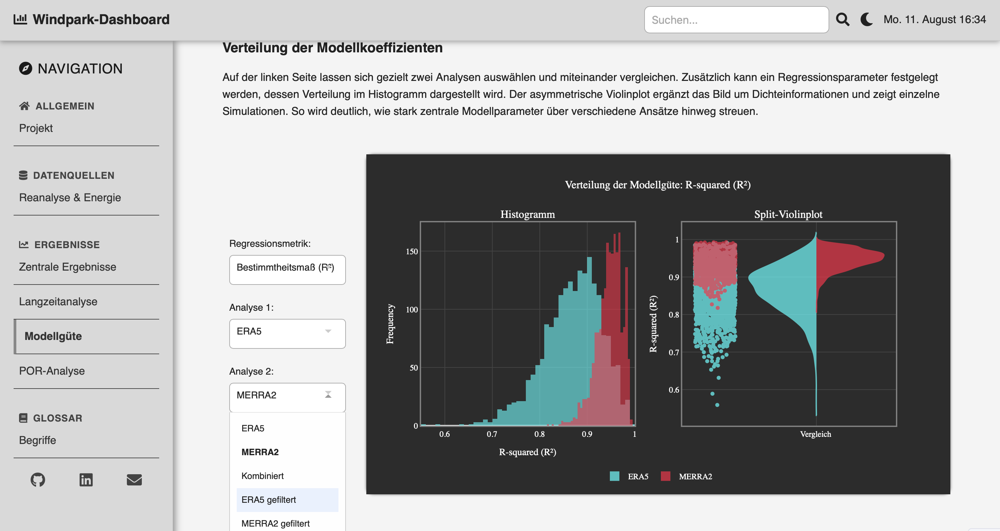
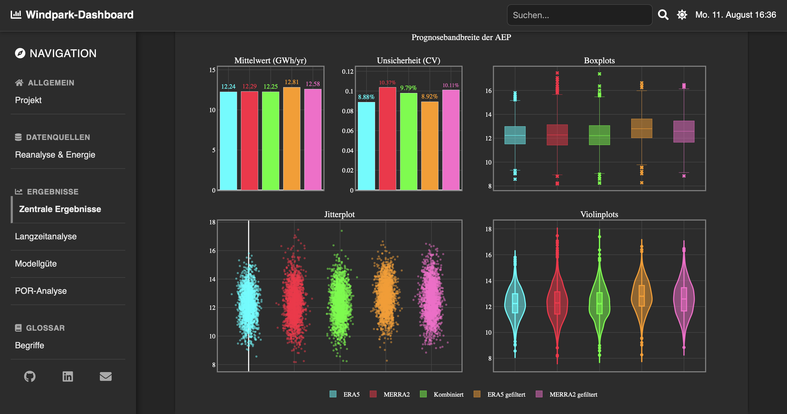

# OpenOA Dashboard – Monte Carlo AEP Analysis

An interactive dashboard for **visualization and analysis of wind energy simulations** based on the [OpenOA](https://github.com/NREL/OpenOA) library.  
It supports Monte Carlo evaluations, model performance comparisons, uncertainty analysis, and sensitivity metrics within wind park projects.

---


## Features

- Compare multiple reanalysis datasets (ERA5, MERRA2, combined, filtered)
- Interactive visualizations (histograms, violin plots, scatter plots, time series)
- Model quality metrics (R², slope, bias, CV, etc.)
- Iteration analysis and sensitivity exploration
- Switchable light/dark mode
- Modular code structure (callbacks, utils, layouts)

---


## Screenshots

**Light Mode**




**Dark Mode**



---


## Project structure

```
openoa-dashboard/
├── app.py                # Main Dash application
├── assets/               # CSS
├── callbacks/            # Dash callbacks per tab
├── data/
│   ├── raw/              # Input data (CSV simulation results)
│   ├── processed/        # Processed data
│   └── config.py         # Colors, metric definitions
├── layout/               # Tab layouts
├── utils/                # Plot & stats utils
├── requirements.txt      # Dependencies
└── README.md             # This file
```


## Installation & Quickstart

Requires **Python 3.10+**

```bash
# Clone repo
git clone https://github.com/gabrieljonathanabebe/openoa-dashboard.git
cd openoa-dashboard

# (Optional) create virtual environment
python -m venv .venv
source .venv/bin/activate   # Windows: .venv\Scripts\activate

# Install dependencies
pip install -r requirements.txt

# Run app
python app.py
```

App will be available at:
http://127.0.0.1:8050


## Lizenz

MIT License – see [LICENSE](LICENSE)

---


## Autor

Gabriel Jonathan Abebe  
jonathanabebe@outlook.de

---


Hinweis (Deutsch)

Dies ist ein eigenständiges Projekt, das im Rahmen meiner Bachelorarbeit entstanden ist.
Es dient als praktischer Showcase meiner Kenntnisse in Data Analysis, Dash/Plotly und Python.
Der Code ist bewusst modular aufgebaut, um Erweiterungen (weitere Datenquellen, Visualisierungen, etc.) einfach zu ermöglichen.